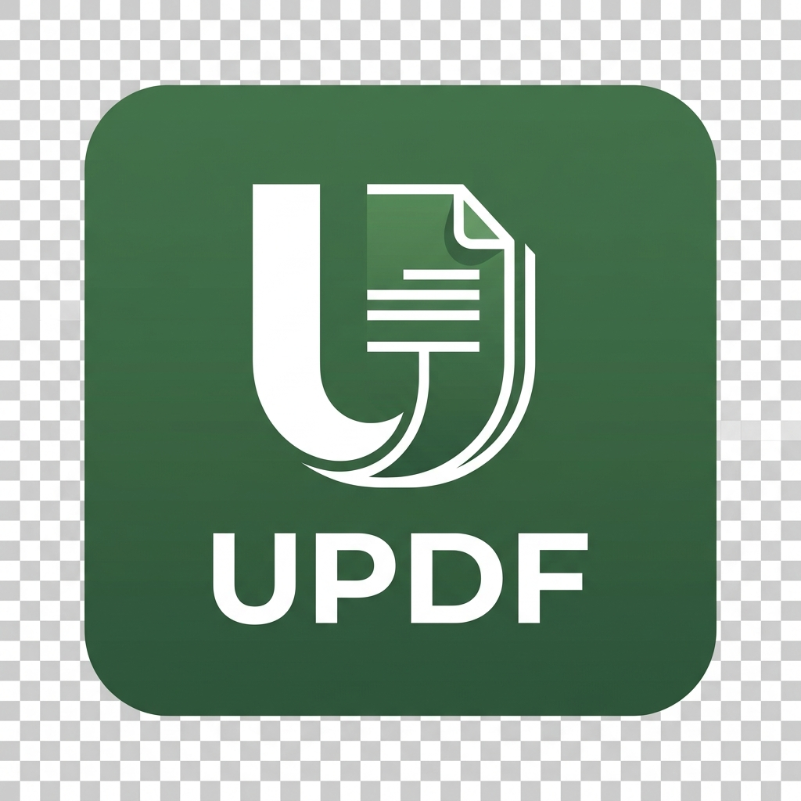

  
  
  # UPDF FCS (União PDF)
  **A ferramenta definitiva para gerenciamento e edição de PDFs em Windows.**

---

O **UPDF FCS** é um aplicativo desktop rápido, leve e profissional desenvolvido em C# (.NET 8 e WPF) projetado para resolver todos os problemas do dia a dia com documentos PDF, sem complicações.

## 🚀 Funcionalidades

- **Anotações Visuais (Drag & Drop):** Insira textos personalizados e carimbe imagens (como assinaturas escaneadas e logos) livremente pelas páginas.
- **Assinatura Digital Profissional:** Assine documentos com valor legal utilizando certificados digitais `.pfx` (e-CPF/e-CNPJ), com suporte a estampas visíveis ou invisíveis.
- **Organização Inteligente:** Separe, junte, rotacione, apague ou insira páginas em branco usando um painel visual prático.
- **Extração Avançada:** Exporte páginas específicas como novos PDFs, como arquivos de imagem (JPG/PNG) ou extraia os dados em texto estruturado direto para planilhas do **Excel (.xlsx)**.
- **Auto-Atualizável:** O sistema varre automaticamente o GitHub em busca de novas versões, mantendo seu programa sempre atualizado.

## 📦 Como Instalar

1. Acesse a aba de [Releases](https://github.com/fernandoc-souza/UPDF/releases) do repositório.
2. Baixe a versão mais recente anexada: `Instalador_UPDF.zip`.
3. Extraia o conteúdo para uma pasta no seu computador.
4. Execute o arquivo `Instalador.bat` (ele pedirá permissão de Administrador para criar os atalhos e associar o sistema).
5. Pronto! O atalho **UPDF** estará na sua Área de Trabalho e Menu Iniciar.

## 💻 Tecnologias Utilizadas

- **C# / .NET 8 (WPF):** Interface moderna e alta performance.
- **iText7:** Motor super robusto de manipulação de PDF, assinaturas e criptografia.
- **WebView2 (Microsoft Edge):** Renderização de documentos nativa em alta definição.
- **ClosedXML:** Geração nativa de planilhas Excel.

## 📄 Licença
Distribuído "as is" (como está) para uso pessoal e profissional. Consulte o código-fonte para mais detalhes sobre as bibliotecas de terceiros utilizadas.
